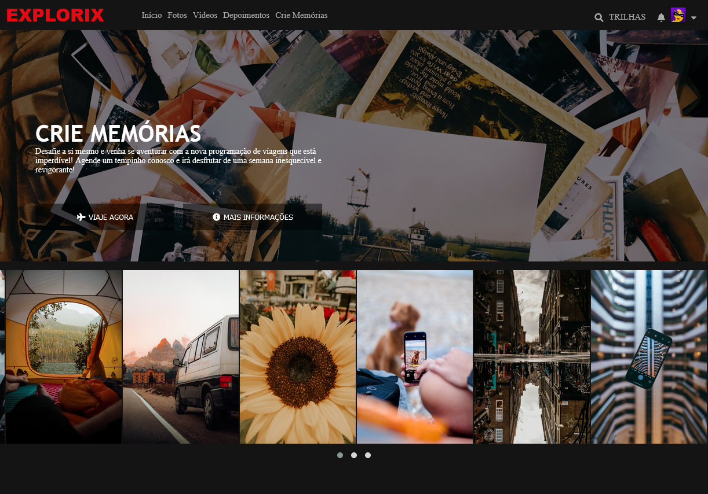

# Clone Netflix: EXPLORIX
Projeto desenvolvido através dos conhecimentos adquiridos com o professor <a href="https://www.linkedin.com/in/felipe-aguiar-047/">Felipe Aguiar</a> ao ensinar a desenvolver o projeto "Recriando a interface da Netflix"na plataforma <a href="https://www.dio.me/sign-in">Digital Innovation One</a>.

## Sumário

<ul>
    <li><a href="#">Sobre o projeto</a></li>
    <li><a href="#">O que há de diferente?</a></li>
    <li><a href="#">Checklist do projeto</a></li>
    <li><a href="#">Estrutura da navegação pelo código</a></li>
    <li><a href="#">Links úteis</a></li>
</ul>

## Sobre o projeto
A ideia principal é entender como funciona a construção dos elementos dentro de uma página web como a Netflix, e assim desenvolver uma visão apurada na hora de tranformar um projeto desenhado em algo concreto, levando em consideração a responsividade, a praticididade e a dinâmica. 

Baseado nisto, resolvi desenvolver uma página que se assemelhe a interface original da Netflix, mas que ao invés de um streaming de filmes e séries, trouxe de forma repaginada uma rede social que possui fotografias, videos e depoimentos referentes a viagens pelo mundo. Como mostra abaixo:

## Quais são as funcionalidades?

### Responsividade

### Efeitos com o CSS

### Carrosel

### Página de acesso do usuário

### Página de conteúdo

## Checklist do projeto

- [x] Usar o elemento nav;
- [x] Efeitos em botões;
- [x] Uso de variavel no CSS;
- [x] Uso das propriedades de FlexBox;
- [x] Padronização de icons com Font Awesome;
- [x] Carrosel de imagens com o uso de um plugin de JQuery;
- [x] Responsividade com o uso de Media Query;
- [ ] Dar "vida" aos botões;

## Estrutura da navegação pelo código

## Links úteis

<ul> 
    <li><a href="https://kit.fontawesome.com/2c36e9b7b1.js">Icons do Font Awesome</a></li>

</ul>